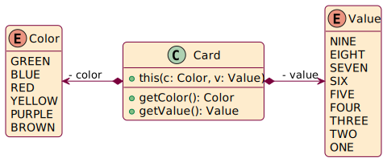
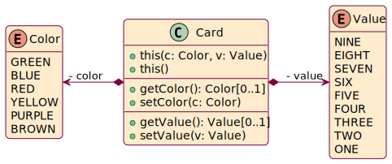

# Absence of value code repository

- Author: Dr. [Sébastien Mosser](https://mosser.github.io)
- Version: 2024.01
- Context: McMaster University > Engineering > Computing & Software > SFWRENG > 2AA4
- License: [CC BY-NC-SA 4.0](https://creativecommons.org/licenses/by-nc-sa/4.0/)

This code repository demonstrates on a simple example how to reprsent the absence of value.

We consider the cards of the game named Schotten Totten. These cards have a value (in [1,9]) and a color (there are six colors).  

## Initial design

- We represent a `Color`(s) and `Value`(s) as enumeration: it is a closed-world situation, and we 
already know all the value a `Color` or a `Value` can take.
- A `Card` contains a `color` and a `value` attributes
  - According to encapsulation principles, these attributes are private
  - As cards are instantiated once and for all, so we only expose getters.
  - In Java, we also make the attributes final to prevent modification, but this is not visible 
    in the UML model as this is not part of UML syntax.

## Introducing the Joker concept

We consider in this reporisoty several implementation of the Joker concept. A Joker is a card that can be 'decided' when played. So when the player uses their joker, they change its value and color to be the one they want.

### Option A - Using `null`

**Design choice**: A joker is a `Card` with both `color` and `value` set to `null`.

 

Consequences:
- (-) We need to add setters to be able to modify the value and the color afterward. So any card 
  can 
  be modified, even if not a joker
- (-) Getters might return `null`, so a `NullPointerException` might be thrown if the caller does 
  not check the return value. It's an abstraction leak: an internal design choice leaks to the 
  caller.

### Option B - Using Inheritance

**Design choice**: We represent Joker as an _extension_ of the `Card` class.

 

Consequences:
- (+) The setters are only exposed in the Joker Class. 
- (+) We create a `Joker` by calling `new Joker()`. As such, we align the code with the 
  business domain.
  - (-) Technical side effect is that to do so, Java requires a default constructor in `Card`. 
    But creating a `Card` without value does not make sense from the `Card` point of view. We 
    mitigate this by making the default constructor protected. 
- (~) we have to make our attributes protected instead of private. We're enlarging their scope, 
  going against encapsulation. Not such a big deal, as only sub-classes such as Joker can have 
  access.
- (-) Calling the getters on the Joker class will throw an UnsupportedOperationException. We're 
  not leaking an internal choice, but we're violating Liskov's principle: If one can call 
  `Card::getColor()`, they should be able to call it on any class that extends `Card`.

### Option C - Using Default Values

**Design choice**: We use default values and colors for the joker class (so we avoid null 
pointers), and add an extra attribute remembering if we created a Joker or not.

Consequences:
- (-) we add an extra state to maintain: the boolean `isJoker?` attribute
- (-) We can accidentally take the joker for a `ONE-BLUE` card. 
- (-) setters are back to the `Card` concept, so we can mutate a regular card.

### Option D - Using an User-Defined Zero

**Design choice**: We create a default `NONE` value in both `Color` and `Value`, that reify the 
absence of value. Like the `0` in maths.

Consequences:
- (+) A Joker is a card with NONE for value and color. This is more aligned with the business logic.
- (-) Setters are in the `Card` concept, so we can mutate a regular card.
- (-) We still have an abstraction leak: `NONE` is not a regular color or value, buyt defined as 
  an equal to the others. This might lead to problems if we iterate over the contents of the 
  enumeration to create all the cards.

### Option E - Using Optionality

**Design choice**: We use the notion of `0` provided by the language, i.e., the capacity of 
declaring signatures with `Optional` return value. An `Optional` can be `Empty` (the zero), or 
`of(x)`, to represent `x`.

**UML syntax**: to represent optionality, we annotate the return type with `[0..1]` to indicates 
that it can return a value, or not. You can also find `Optional<X>`, or `{optional}`. There is no 
standard way to represent this in UML.

**Consequences**:
- (+) It is now clear in the signature of the getters that we're facing an absence of value 
  situation.
- (+) This is done without polluting `Color` or `Value`, or by returning `null` by accident
- (-) We have not solved the setters problem.

### Exercise

Provide a model of the situation that would be better than the five previous ones.

